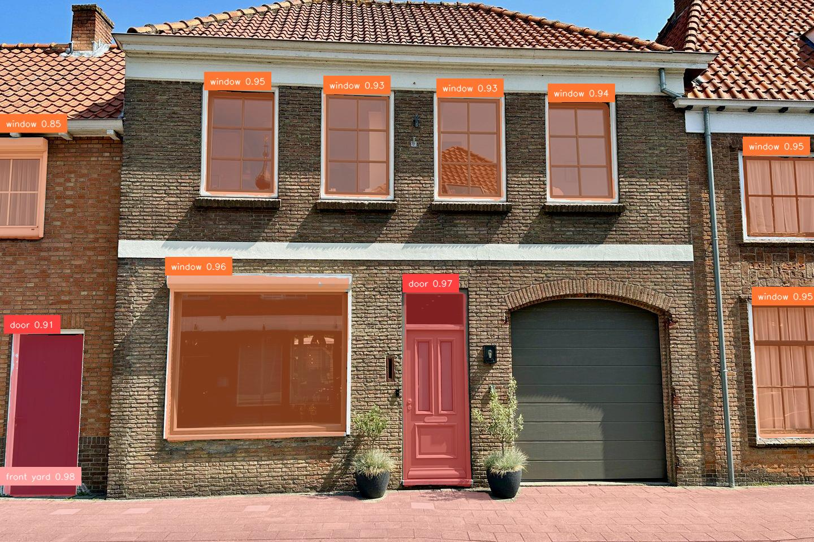

## groundingdino_sam.ipynb

Here a pipeline is implemented where first bounding boxes are calculated using Zero Shot Object Detection 
based on the pretrained model `IDEA-Research/grounding-dino-base` (the same as in groundingdino_vanilla), 
followed by a second stage, a Segment Anything model that calculates segment masks and bounding polygons.
One of the advantages of a pipeline is that it is relatively easy to change the components.
To demonstrate this, two different models have been used as a second stage, `mobile_sam` and `sam2_b` from ultralytics SAM.

The stage one model, followed by each of the stage two models, is ran for each of the 181 images in the `ds/grounding_dino_sam/full` directory. 
This is a relatively fast process even without GPU, taking 30 seconds per image for stage one, 2 seconds per image for mobile_sam, 
and 11 seconds per image for sam2_b.

In the output directory `ds/grounding_dino_sam/full_output` four output images are stored for each input image:
- annotated image for mobile_sam (original image with the segmentation masks superposed on it)
- black image with only the segmentation masks for greater clarity
- annotated image for sam2_b (original image with the segmentation masks superposed on it)
- black image with only the segmentation masks for greater clarity

The results obtained by mobile_sam were consistently better than those of sam2_b

