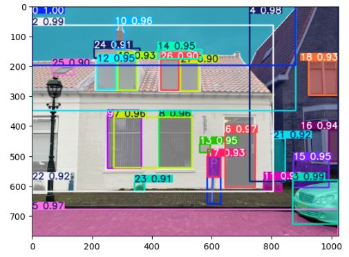

## florence2_colab.ipynb

```
from transformers import AutoProcessor, AutoModelForCausalLM  
```

The Zero Shot Object Detection model is based on the pretrained model `microsoft/Florence-2-large`.

## sam_segmentation.ipynb

```
from ultralytics import SAM
model = SAM("sam2_b.pt")
results = model("autoima/279_1440x960.jpg", project="segment_everything", save=True, save_txt=True)
```

The SAM model `sam2_b` from ultralytics SAM is used for predicting all segments in one image.

This approach was not really useful for the Parsing House Facades project:
- computationally intensive, it took 300 seconds without GPU on one image
- too many results as we are only interested in selected objects. Bounding boxes and segmentation masks are calculated for all the objects detected in the image.
- this is instance segmentation, e.g. each of the "windows" objects is considered a different class. So there is no notion of a "windows" class.




